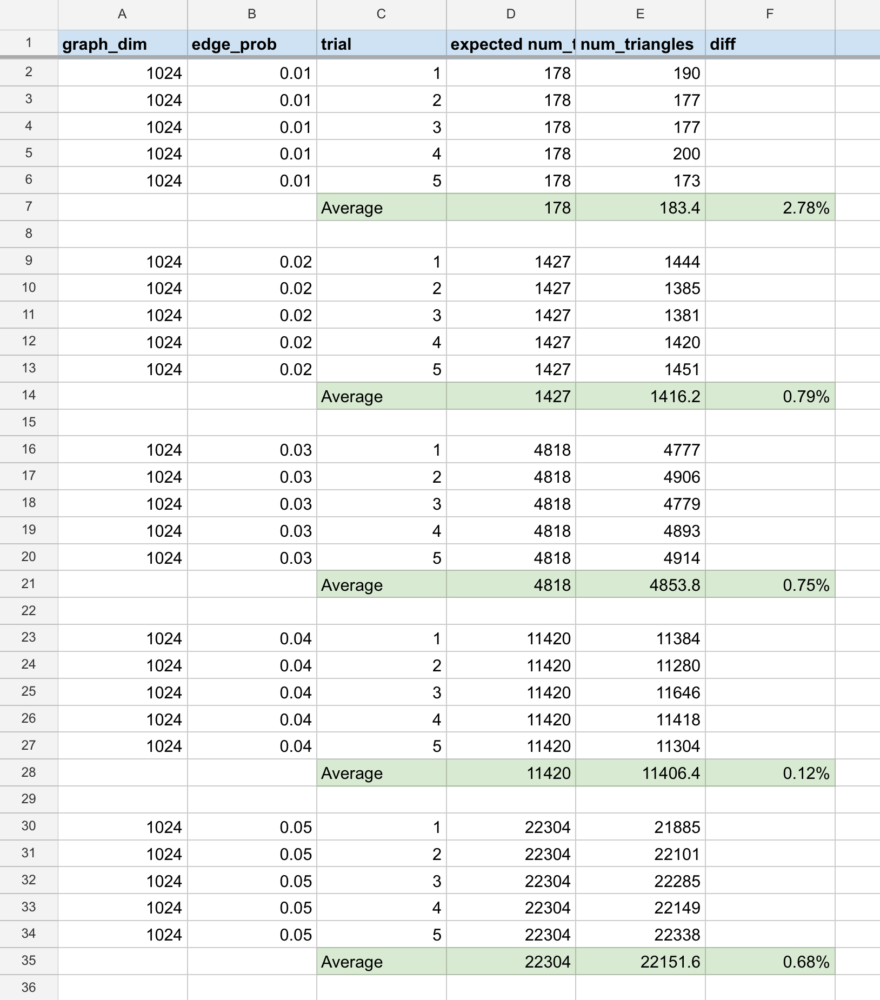

_Cory Zimmerman_ \
_March 2024_

# Strassen’s Algorithm

This repo contains a Rust program with Strassen’s algorithm, recursive matrix multiplication, and iterative matrix multiplication. There are also some experiments investigating the optimal base case at which Strassen’s algorithm should switch to iterative multiplication.

### Setup:

Running this code requires a local installation of Rust. Calling the executable without arguments prints CLI options, which include running the experiments. Tests can be run with `cargo test —release`.

### Analytical crossover:

Assume the only operations of nonzero cost are integer arithmetic. Under this simplification, consider the optimal point at which Strassen’s algorithm should switch to iterative multiplication. Begin by assessing the iterative matrix multiplication algorithm:

- The first for loop requires n additions for index iteration.
- The second for loop requires n additions n times for index iterations.
- The third for loop requires n by n by n additions for index iterations. There's also one addition and one multiplication for each index.
  So, on an input of size n, that yields `f(n) = 2n^3 + n^3 + n^2 + n = 3n^3 + n^2 + n`. That’s the amount of work required for the base case of size n_0 in the modified version of Strassen's algorithm.

The recurrence for Strassen's algorithm is `T(n) = 7T(n / 2) + Θ(n^2)`. However, the `Θ(n^2)` term actually masks 18 matrix additions and subtractions. Each addition on a matrix takes about n^2 arithmetic operations. Because this happens at each stage of recursion, estimate the recurrence to more accurately be `T(n) = 7T(n / 2) + 18n^2` with a base case of cost `T(n) = 3n^3 + n^2 + n`.

Because the goal is to generate a numerical estimate for an optimal n_0, I chose constants and worked backward computationally towards an estimate. I wrote a simple script in [estimate_convergence.py](results/estimate_convergence.py) that calculates the value of this recurrence for different values of n and n_0. Among the tested values of n = 256, 512, 1024, 2048, and 8192, the most optimal value of n_0 for all was 32. So, I estimate that a favorable base-case crossover for this modified version of Strassen's algorithm is n_0 = 32.

### Implementation notes:

Strassen’s algorithm is much more memory intensive than the iterative approach. To avoid excessive memcpy, my implementation uses two matrix types. The first, called [Matrix](src/mtx/matrix.rs), is an owned n by n vector with publicly available operations. Internally, there’s also a [SliceMatrix](src/mtx/slice_matrix.rs) type, where most of the work actually happens. SliceMatrix is a window over the owned Matrix. A SliceMatrix can be located anywhere on the parent Matrix and have any dimensions as long as they're in bounds of the parent. In the recursive multiplication algorithms, downward recursion simply splits a SliceMatrix into four sub-slices until the base case is reached. After the base case, however, memory allocations are needed to store intermediate computations and return the final product. I again tried to limit these by performing in-place operations where possible.

My submitted code pads the input Matrix to a square power of two before performing multiplication. I had initially tried to attach only single rows or columns of padding as-needed during recursion, but doing so correctly was very difficult. As part of that process, I implemented the `O(n^3)` recursive multiplication algorithm. It used much of the same infrastructure as Strassen’s algorithm and was significantly easier to debug. In the final code, I kept the third multiplication algorithm but stuck with a simpler approach to padding. To ensure correctness, I also wrote some fairly comprehensive tests. They verify all three algorithms against test data generated with numpy.

### Empirical crossover:

Generating matrices with random integer data, I collected the time taken to multiply two n by n matrices with dimensions 256, 512, 1024, 2048, and 4096. Each dimension is a power of two, so my crossover calculation only considers cases without padding. For each dimension, I tested every power of two crossover from 4 to n. For example, the test for 256 gathered timings for base cases at 4, 8, 16, 32, 64, 128, and 256. At dimension n = 256, the fastest multiplication occurred at n = 32, but the difference to n = 64 was less than a millisecond. For all others, the fastest multiplication occurred at n = 64. So, for my implementation, it seems the optimal crossover point from Strassen’s algorithm to iterative multiplication occurs when n_0 = 64 (give or take 32).

This crossover point is close to the estimate but was much lower than I expected. Because of testing, I am confident of its correctness. However, if my code has performance variance from what is expected, I suspect two things. First, my iterative multiplication was disadvantaged to support code simplicity and the SliceMatrix abstraction. Because the iterative algorithm occurs on a SliceMatrix, every index incurs both my verification that the index is within the slice window and Rust’s verification that the index is into valid memory. That adds non-trivial overhead to the hottest part of the code. Also, because SliceMatrix placement can be quite arbitrary, the cache locality is generally unfavorable. Second, I suspect something big is happening with LLVM that meaningfully improves the recursive algorithms. Running all my test functions in debug mode takes about 12 seconds, and running the identical tests in release mode takes less than 0.5 seconds. Something about the code is getting meaningfully rewritten during compilation, and LLVM-favorability likely has an effect on the relative performance of the algorithms.

My results are available here: [https://docs.google.com/spreadsheets/d/1-cCuI_vJ-2KyEVd8rqGA2vrwpvcApGM5jP6npT88x94/edit](https://docs.google.com/spreadsheets/d/1-cCuI_vJ-2KyEVd8rqGA2vrwpvcApGM5jP6npT88x94/edit?usp=sharing).

### Triangles

The code for this is mostly in [experiments.rs](src/mtx/experiments.rs), which again wrote results to a CSV. My initial data was a bit noisy, so I revised the experiment to run over five trials for each edge probability. On average, my results are close to the expectation. Below is a screenshot of the results, which can also be found at the link below.

Triangle results: https://docs.google.com/spreadsheets/d/1QtmXFr4jyuVd8PdbIQiH1BcFles6f24Xz014z8aFsOs/edit

